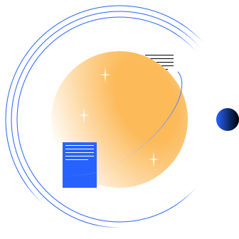
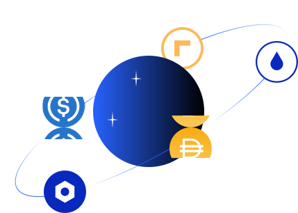

<!-- Imports -->

import LatestNewsSection from '../partials/home/LatestNewsSection';
import TinlakeCard from '../components/TinlakeCard';

<!-- Intro -->
<Section>
<Row>
<Col span={4}>
<Heading lined style={{ fontSize: "24px" }}>
Decentralized Asset Finance
</Heading>
</Col>
</Row>
<Row>
<Col span={4}>
<Text size="20px" textAlign="center" weight={500} margin={{ bottom: "large" }}>
Access bankless liquidity. Use Centrifuge to bring your assets into DeFi.
</Text>
<Button primary href="/borrow" label="Borrow" />
</Col>
<Col span={4}>

</Col>
<Col span={4}>
<Text size="20px" textAlign="center" weight={500} margin={{ bottom: "large" }}>
Invest in diversified asset-backed pools. Generate a return on stable assets.
</Text>
<Button primary href="/invest" label="Invest" />
</Col>
</Row>
</Section>

<!-- Tinlake Release -->
<TinlakeCard heading="See how an open source, asset-backed lending protocol works with our first Dapp">
<Box gap="small">
<Row>
<Col span={4}>

### Unlock Liquidity

</Col>
<Col span={4}>

### Without the banks

</Col>
<Col span={4}>

### Made by people who understand finance + innovation

</Col>
</Row>
<Row>
<Col span={4}>

Asset Originators can collateralize invoices, royalties, and other real-world assets for untapped liquidity in DeFi.

</Col>
<Col span={4}>

That means your money and collateral passing through fewer hands. An end-to-end solution, powered by our RAD token.

</Col>
<Col span={4}>

We are a team of innovators from both traditional Fintech and DeFi. Together, we find the best way to connect both worlds.

</Col>
</Row>
</Box>
</TinlakeCard>

<!-- Latest News -->
<LatestNewsSection />

<!-- The Open Protocol to Access Decentralized Future -->
<Section>
<Row>
<Col span={5}>

</Col>
<Col span={1}></Col>
<Col span={6}>

<Heading lined margin={{ bottom: "medium" }} style={{ fontSize: "24px" }}>
The Open Protocol to Access Decentralized Finance
</Heading>

We see a future of open finance, where businesses use decentralized currencies to make our world spin. The Centrifuge protocol is open source and built to plug your business to Web 3.

<Button primary label="Add us to your Stack" align="end" margin={{ top: "medium" }} />

</Col>
</Row>
</Section>

<!-- DeFi is a grassroots finanical movement, powered by the community. -->
<Section>
<Row>
<Col span={6}>

# DeFi is a grassroots finanical movement, powered by the community.

The DeFi community is different from anything the financial world has seen before. Token holders have a voice and a vote on the direction of the protocol. All of our protocols are interdependent on one another, making it a financial system powered by community. 

We are proud to take part in the larger DeFi ecosystem, one that demands the financial world to revisit its purpose in the first place: to circulate and distribute money in a fair and trustless way. 

<Button primary label="Join the conversation on Discourse" align="end" margin={{ top: "medium" }} />

</Col>
<Col span={1}></Col>
<Col span={5}>
<Box gap="large">
<Text size="20px" textAlign="center">Building a fair financial system with:</Text>
<Image src="../images/home/maker_logo.svg" />
<Image src="../images/home/celo_logo.svg" />
<Image src="../images/home/circle_logo.svg" />
</Box>
</Col>
</Row>
</Section>

<!-- Radial Token -->
<Section>
<Image src="../images/radial-token-logo.svg" margin={{ bottom: "large" }} />
<Heading lined alignSelf="center" margin={{ bottom: "large" }}>Centrifuge is powered by Radial token</Heading>
<Button primary label="Learn about RAD" />
</Section>
