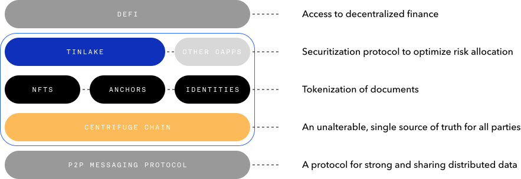
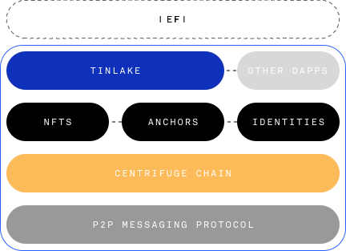
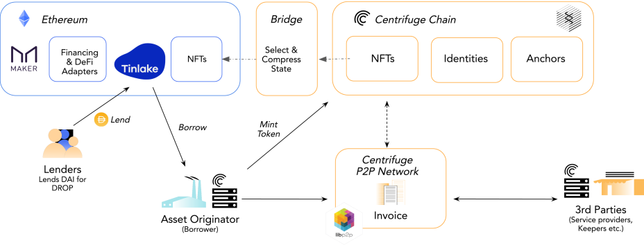

<!-- Imports -->

import portal_icon from "../../images/chain/icons/portal.svg";
import telemetry_icon from "../../images/chain/icons/telemetry.svg";
import subscan_icon from "../../images/chain/icons/subscan.png";
import rad_icon from "../../images/icons/rad.svg";

<!-- What -->
<Section>
<Row>
<Col span={5} align="start">
<Text size="xxlarge" weight="bold" margin={{ bottom: "large" }} textAlign="start">
Centrifuge Chain — The Gateway for Real-World Assets into DeFi
</Text>

<Image src="../../images/chain/chain.svg" alignSelf="start" margin={{ bottom: "small" }} />

</Col>
<Col span={1}></Col>
<Col span={6}>

# What is Centrifuge Chain?

Centrifuge Chain is the gateway for real-world assets to the Blockchain Multiverse. We built Centrifuge Chain on Parity Substrate with an initial bridge to Ethereum. This allows us to move faster and use a consistent approach for certain features.

We envision a larger ecosystem of many, connected blockchains- where Dapps on Ethereum could use data from other chains, value could move freely, and Centrifuge Chain can enable off-chain assets to access financing through DeFi.

</Col>
</Row>
</Section>

<!-- Interact -->
<Section>

<Box align="center" margin={{ bottom: "medium" }}>
<Text size="large">
Interact with Centrifuge Chain:
</Text>
</Box>

<ResponsiveContent breakpoints={["medium", "large"]}>
<Box justify="center" direction="row" gap="xlarge">

<Button plain href="https://portal.chain.centrifuge.io" label="Chain Portal" icon={<Image height="20px" src={portal_icon} />} />
<Button plain href="https://telemetry.polkadot.io/#list/Centrifuge%20Mainnet" label="Telemetry" icon={<Image height="20px" src={telemetry_icon} />} />
<Button plain href="https://centrifuge.subscan.io" label=" " icon={<Image height="20px" src={subscan_icon} />} />

</Box>
</ResponsiveContent>
<ResponsiveContent breakpoints={["small"]}>
<Box justify="center" gap="small">

<Button plain href="https://portal.chain.centrifuge.io" label="Chain Portal" icon={<Image height="20px" src={portal_icon} />} />
<Button plain href="https://telemetry.polkadot.io/#list/Centrifuge%20Mainnet" label="Telemetry" icon={<Image height="20px" src={telemetry_icon} />} />
<Button plain href="https://centrifuge.subscan.io" label=" " label=" " icon={<Image height="20px" src={subscan_icon} />} />

</Box>
</ResponsiveContent>

</Section>

<!-- Validation -->
<Section>
<Row>

<Col span={6} align="start">

# Validating Centrifuge Chain

Centrifuge Chain is a Proof-of-Stake blockchain built on Substrate that enables users to bring their assets on-chain as non-fungible tokens (NFTs). This is the starting point for originating real-world assets on the blockchain - to begin to unlock financing for any type of asset. This public chain is owned and operated by no single party: the Centrifuge token empowers its holders with governance and provides the incentive for validators to operate the chain. Bridged to Ethereum from day 1.

<ResponsiveContent breakpoints={["medium", "large"]}>

<Box direction="row" justify="between" margin={{ top: "large" }}>

<Box justify="between" height="120px" width="small">
<Text size="20px" textAlign="start">Consensus</Text>
<Text size="32px" textAlign="start" weight={500}>NPoS</Text>
</Box>

<Box justify="between" height="120px" width="small">
<Text size="20px" textAlign="start">Validator Slots</Text>
<Text size="32px" textAlign="start" weight={500}>23</Text>
</Box>

<Box justify="between" height="120px" width="small">
<Text size="20px" textAlign="start">Estimated Block Reward</Text>
<Box direction="row" gap="xsmall" align="end" justify="start">
<Text size="32px" weight={500}>3%</Text>
<Text size="small" weight={500}>per year</Text>
</Box>
</Box>

</Box>

</ResponsiveContent>
<ResponsiveContent breakpoints={["small"]}>

<Box gap="large" margin={{ top: "large" }} align="center">

<Box justify="between" width="small" gap="medium">
<Text size="20px" textAlign="center">Consensus</Text>
<Text size="32px" textAlign="center" weight={500}>NPoS</Text>
</Box>

<Box justify="between" width="small" gap="medium">
<Text size="20px" textAlign="center">Validator Slots</Text>
<Text size="32px" textAlign="center" weight={500}>23</Text>
</Box>

<Box justify="between" width="small" gap="medium">
<Text size="20px" textAlign="center">Estimated Block Reward</Text>
<Box direction="row" gap="xsmall" align="end" justify="center">
<Text size="32px" weight={500}>3%</Text>
<Text size="small" weight={500}>per year</Text>
</Box>
</Box>

</Box>

</ResponsiveContent>

</Col>
<Col span={1} margin={{ top: "72px" }} />
<Col span={5}>

<Box gap="large">

<Text size="20px" textAlign="center">Some of our validators</Text>

<Box>

<Row mb="large">
<Col span={5} align="center">
<a href="https://portal.chain.centrifuge.io/#/staking" target="_blank"><Image src="../../images/chain/validators/purestake_logo.svg" /></a>
</Col>
<Col span={2} margin={{ bottom: "large" }}></Col>
<Col span={5} align="center">
<a href="https://portal.chain.centrifuge.io/#/staking" target="_blank"><Image src="../../images/chain/validators/chorus_logo.svg" /></a>
</Col>
</Row>

<Row mb="large">
<Col span={5} align="center">
<a href="https://portal.chain.centrifuge.io/#/staking" target="_blank"><Image src="../../images/chain/validators/stakecapital_logo.svg" /></a>
</Col>
<Col span={2} margin={{ bottom: "large" }}></Col>
<Col span={5} align="center">
<a href="https://portal.chain.centrifuge.io/#/staking" target="_blank"><Image src="../../images/chain/validators/staked_logo.svg" /></a>
</Col>
</Row>

<Row>
<Col span={5} align="center">
<a href="https://portal.chain.centrifuge.io/#/staking" target="_blank"><Image src="../../images/chain/validators/stakefish_logo.svg" /></a>
</Col>
<Col span={2} margin={{ bottom: "large" }}></Col>
<Col span={5}>

<Button plain href="https://portal.chain.centrifuge.io/#/staking" target="_blank" label="and many more..." />

</Col>
</Row>

</Box>

</Box>

</Col>

</Row>

</Section>

<!-- Validator -->
<Section>

# Run Your Own Validator

If you are interested in running a Validator for Centrifuge Chain, check out our documentation to get started! The Flint and Amber testnets are a great way to get up and running. One of the main benefits of becoming a validator on Centrifuge testnets first is to get experience running your own Centrifuge Chain node and to test your infrastructure.

<ResponsiveContent breakpoints={["medium", "large"]}>
<Button href="https://developer.centrifuge.io/chain/overview/introduction/" alignSelf="end" label="Centrifuge Chain Documentation" />
</ResponsiveContent>
<ResponsiveContent breakpoints={["small"]}>
<Button href="https://developer.centrifuge.io/chain/overview/introduction/" label="Centrifuge Chain Documentation" />
</ResponsiveContent>

</Section>

<!-- Why -->
<Section>

# Why did we build Centrifuge Chain?

We built Centrifuge Chain to enable businesses to exchange business documents (such as invoices) and tokenize those assets to have greater access to financing — thereby unlocking value that has previously been inaccessible. Our mission is to change the rules of global trade to foster economic opportunity everywhere.

<ResponsiveContent breakpoints={["medium", "large"]}>
<Button plain href="/products/deep-tier-finance" label="Use Case: Deep Tier Finance" alignSelf="start" />
</ResponsiveContent>
<ResponsiveContent breakpoints={["small"]}>
<Button plain href="/products/deep-tier-finance" label="Use Case: Deep Tier Finance" />
</ResponsiveContent>

</Section>
<FullWidthSection>

<ResponsiveContent breakpoints={["medium", "large"]}>

</ResponsiveContent>
<ResponsiveContent breakpoints={["small"]}>

</ResponsiveContent>

</FullWidthSection>

<!-- How -->
<Section>

# How does Centrifuge Chain work?

Using Centrifuge Chain, businesses can convert their Real World Assets (RWA) into Non-Fungible Tokens (NFTs). This enables Asset Originators to put up these NFTs as collateral in Tinlake pools on Ethereum. Centrifuge Chain is an open source PoS blockchain built for finance and powered by the Centrifuge (CFG) token. Tinlake taps into the Centrifuge ecosystem, including the Centrifuge Chain and a P2P messaging protocol, to bring DeFi to a consumer-ready interface.

</Section>
<FullWidthSection>

</FullWidthSection>

<!-- Chain Architecture -->
<Section>

# Chain Architecture

Centrifuge Chain uses its own native token - the Centrifuge (CFG) token. It also incentivizes Validators and Nominators to participate through a block reward.

Centrifuge Chain uses [Parity Substrate](https://www.substrate.io), and relies on staked Validators to come to consensus in order to commit blocks to the blockchain. Any node can offer itself as a Validator candidate, but only a limited number will be selected. Only top Validators by stake are elected into the Validator Set. Validators can stake their own CFG and can be elected by staked Nominators.

Centrifuge token also empowers its holders with governance. Centrifuge Chain uses Substrate’s native governance module, comprising an elected council and the ability to administrate network upgrades.

Read more in our <a href="https://developer.centrifuge.io/chain/overview/introduction/" target="_blank">documentation</a>.

</Section>

<!-- Centrifuge Token -->
<Section>

<Image src="../../images/radial-token-logo.svg" margin={{ bottom: "medium" }}/>

# The Centrifuge Token

The Centrifuge token (CFG) powers Centrifuge Chain. CFG is designed to incentivize desirable behavior on Centrifuge Chain — so called mechanism design — to create a robust, decentralized system. Owning CFG gives users a stake in the Centrifuge network and can be used to pay for transaction fees, stake towards Validators, and participate in Centrifuge on-chain governance. It will also incentivize Validators and Nominators to participate through a block reward.

<ResponsiveContent breakpoints={["medium", "large"]}>
<Button href="https://ir.centrifuge.io/static/rad-executive-summary-1d6380e77c1518e69336704bd17cea99.pdf" label="Read Token Summary" align="end" />
</ResponsiveContent>
<ResponsiveContent breakpoints={["small"]}>
<Button href="https://ir.centrifuge.io/static/rad-executive-summary-1d6380e77c1518e69336704bd17cea99.pdf" label="Read Token Summary" />
</ResponsiveContent>

</Section>

<Section>
<Row>

<Col span={6} align="start">

<Text size="20px" weight={500} margin={{ bottom: "large" }}>Need CFG?</Text>

<Box direction="row" gap="medium" align="start">

<Image src="../../images/chain/faucet.svg" />

<Box gap="medium">

<Text>Interested to run a Validator or interact with Centrifuge Chain? Email faucet@centrifuge.foundation.</Text>

</Box>

</Box>

</Col>
<Col span={1} margin={{ bottom: "xlarge" }}></Col>
<Col span={5} align="start">

<Text size="20px" weight={500} margin={{ bottom: "large" }}>Token Specs</Text>

<Box gap="xsmall" margin={{ bottom: "medium" }}>
<Text textAlign="start">Issued at genesis:</Text>
<Text size="20px" textAlign="start" weight={500}>411,947,170 CFG</Text>
</Box>

<Box gap="xsmall">
{/* TODO: Change Metric
<Text textAlign="start">Supply Cap:</Text>
<Text size="20px" textAlign="start" weight={500}>1,000,000,000 CFG</Text>
*/}
</Box>

</Col>

</Row>
</Section>
