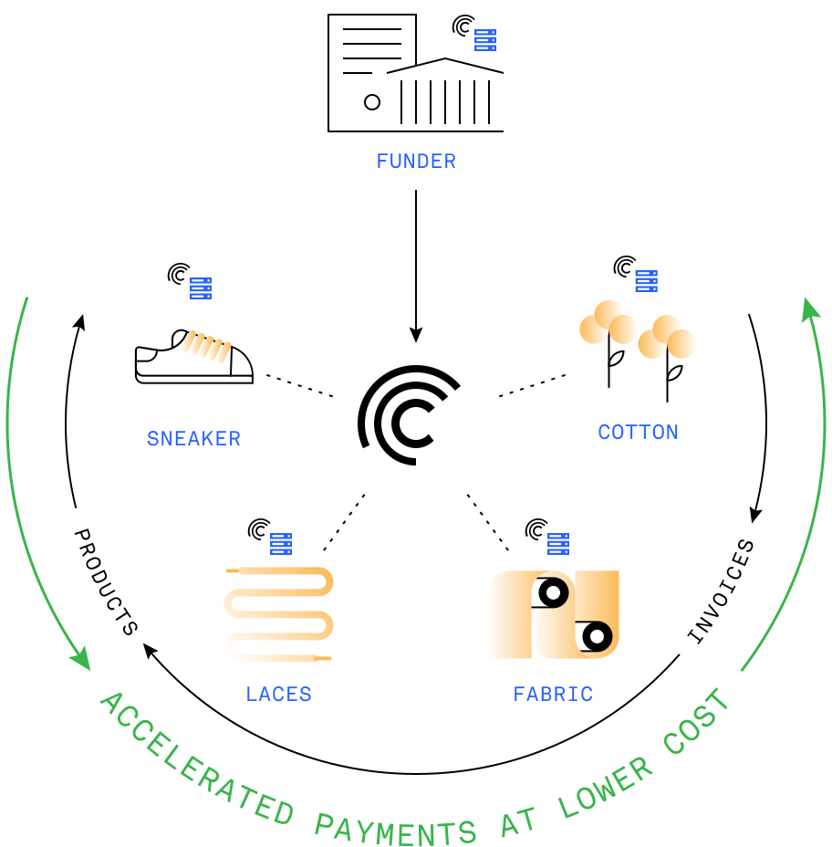
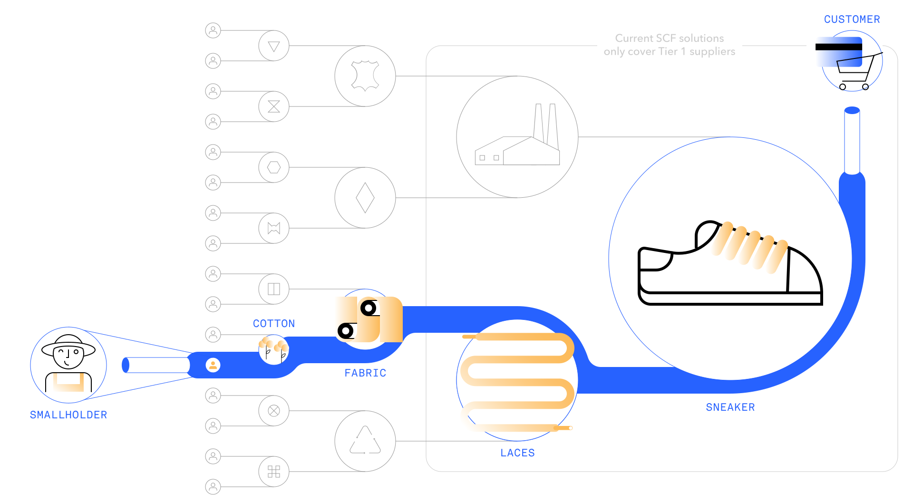

<!-- Imports -->

import { MoreDetails, ResponsiveDetailsImage } from "../../partials/deep-tier-finance/HowDoesDTFWork";

<!-- What -->
<FullWidthSection>
<Row>
<Col span={6} align="start">

<ResponsiveContent breakpoints={["medium", "large"]}>
<Text size="40px" margin={{ bottom: "xlarge" }}>
Deep 
Tier 
Finance
</Text>
</ResponsiveContent>

<ResponsiveContent breakpoints={["small"]}>
<Text size="40px">
Deep 
Tier 
Finance
</Text>
<Box margin={{ vertical: "large" }}>

</Box>
</ResponsiveContent>

# What is Deep Tier Finance?

Deep Tier Finance is an innovative financing solution for locked-up working capital in supply chains. As trust and reputation of large companies ripple down the supply chain through transparent business relations, blockchain-based Deep Tier Finance enables financing at better rates, deeper into the supply chain. Deep Tier Finance is made possible by Centrifuge OS, a decentralized, trustless blockchain-based technology that provides an immutable, censorship-resistant, single source of truth for all participants of the network.

</Col>
<ResponsiveContent breakpoints={["medium", "large"]}>
<Col span={1} />
<Col span={5}>

</Col>
</ResponsiveContent>
</Row>
</FullWidthSection>

<!-- Comparison -->
<Box tag="section" background="brand">
<Section>

<Heading lined level={2} style={{ borderBottomColor: '#d8d8d8' }}>
Traditional vs Deep Tier Financing
</Heading>

Traditional supply chain finance models rarely reach beyond the first-tier suppliers of large corporates, and thus exclude the long tail and deeper tiers. Micro, Small, and Medium-sized Enterprises, often located in emerging and frontier markets, represent the biggest portion of these deeper tiers and are in most need of access to capital. Deep Tier Finance tackles this problem.

<Row mt="large">
<Col span={6}>

<Box pad="40px">

### Traditional Supply Chain Financial Solutions

- Covers only Tier 1 suppliers
- Prolonged turnaround time
- Manual processing of documents
- Incomplete transactional information
- Vulnerable to fraud risk

</Box>
</Col>
<Col span={6}>
<Box round background="white" pad="40px">

### Centrifuge’s Deep Tier Financing

- Covers the entire supply chain
- Quick turnaround time via full automation
- Simple, transparent online process
- Immutability and traceability of data
- Full commercial privacy
- Additional sustainability data layer

</Box>
</Col>
</Row>
</Section>
</Box>

<!-- DTF Image -->
<Section>

</Section>

<!-- How -->
<Section>

# How does Deep Tier Finance work?

Through the use of Centrifuge OS, an open blockchain protocol for supply chains, suppliers will be able to easily prove their credit-worthiness as they build a reputation with their customers over time, and this, in turn, will help to obtain financing. In addition, the trust and reputation of large companies ripple down the supply chain through interconnected business relations. Business sensitive information is selectively shared and verified immutably on-chain.

Imagine a simplified sneaker supply chain, from a Cotton Grower to a large Sneaker producer. Products are being delivered and invoices issued constantly throughout the supply chain. There is also an external “Funder” such as a factor. All entities are connected by the decentralized Centrifuge OS and share selected, encrypted data, such as outstanding amounts and due dates readable only to the next intermediary in the chain. No sensible data, such as materials or quantities are revealed - companies retain full sovereignty over their data.

Cotton Grower sends an early payment request to Fabric. This request is matched with outstanding amounts between Fabric and Laces and passed through the supply chain until it reaches Sneaker. Sneaker, can either finance the request from their excess liquidity (Dynamic Discounting approach) or confirm their willingness to pay their outstanding invoice from Laces to Funder (Reverse Factoring approach). Funder then provides financing for a rate based on Sneakers credit risk. This financing is passed back through the supply chain, until it reaches Cotton Grower.

</Section>

<Section>
<ResponsiveDetailsImage data={{ aboveImage: "Financing requests and outstanding amounts are matched and passed through the supply chain", belowImage: "Financing at lower rates and excess liquidity is passed back through the supply chain" }} />
</Section>

<MoreDetails data={{ aboveSteps: ["Cotton Grower requests an early payment from Fabric.", "Fabric matches this request with outstanding invoices against Laces and asks for an early payment of its invoice  to Laces.", "Laces  matches the request with outstanding invoices against Sneaker and requests an early payment request from Sneakers.", "Sneakers as the anchor buyer has access to capital and can finance the request that was passed on from Cotton Grower all the way to Sneakers through the supply chain."], belowSteps: ["Thus, a few minutes after the request for early payments (all transactions are automated), Cotton Grower receives financing at a rate based on Sneakers credit rating.", "Fabric does the same with Cotton Grower.", "Laces sees the early payment from Sneakers and forwards that on to Fabric by paying an invoice to Fabric early. For facilitating this transaction, Laces can charge a small fee on this transaction.", "Sneakers confirms the early payment request to Laces and settles the transaction by paying the invoice from Laces early."] }} />

<!-- Powered by Centrifuge -->
<Box tag="section" background="black">
<Section>

<Heading lined level={2} style={{ display: 'flex', borderBottomColor: '#d8d8d8' }}>
Powered by <Image src="../../images/centrifuge-wordmark-light.svg" margin={{ left: "medium" }} />
</Heading>

Centrifuge OS is an open, decentralized platform to connect the global financial supply chain. It provides participants with an immutable, censorship-resistant, single source of truth for shared documents like invoices and purchase orders - the missing technology to enable Deep Tier Finance. This allows all tiers of a supply chain to interact with each other without giving up ownership of their data. No centralized entity will be needed anymore to coordinate between participants and extract rents.

</Section>
</Box>

<!-- Benefits -->
<Section style={{ marginBottom: "0" }}>

# Why is this beneficial?

Deep Tier Finance would provide entire supply chains with cheaper access to funding for their working capital. This would benefit all parties involved:

</Section>
<FullWidthSection style={{ marginTop: "0" }}>
<Row>
<Col span={4} align="start">
<Box direction="row" gap="small" margin={{ top: "large", bottom: "small" }}>
<Image src="../../images/deep-tier-finance/suppliers_1.svg" height="70" />
<Image src="../../images/deep-tier-finance/suppliers_2.svg" height="70" />
<Image src="../../images/deep-tier-finance/suppliers_3.svg" height="70" />
</Box>

### Suppliers

Suppliers finance their working capital at significantly lower rates than before.

</Col>
<Col span={4} align="start">
<Box direction="row" gap="small" margin={{ top: "large", bottom: "small" }}>
<Image src="../../images/deep-tier-finance/buyers.svg" height="70" />
</Box>

### Buyers

Buyers secure their supplier’s financial health, protect their supply chains and benefit from cost savings created from better supply chain management, lower costs of credit and better liquidity for their entire supply. chain.

</Col>
<Col span={4} align="start">
<Box direction="row" gap="small" margin={{ top: "large", bottom: "small" }}>
<Image src="../../images/deep-tier-finance/funders.svg" height="70" />
</Box>

### Funders

Funders extend their business across the entire supply chain at lower the risk of a reputable buyer.

</Col>
</Row>
</FullWidthSection>

<!-- Contact -->
<Section margin={{ bottom: "xlarge" }}>
<Heading lined margin={{ bottom: "xlarge" }} style={{ paddingBottom: "0" }} />
<Text size="20px" alignSelf="center">If you are interested in Deep Tier Finance,</Text>
<Text size="20px" alignSelf="center">please get in touch: <a href="mailto:deeptierfinance@centrifuge.io">deeptierfinance@centrifuge.io</a></Text>
</Section>
