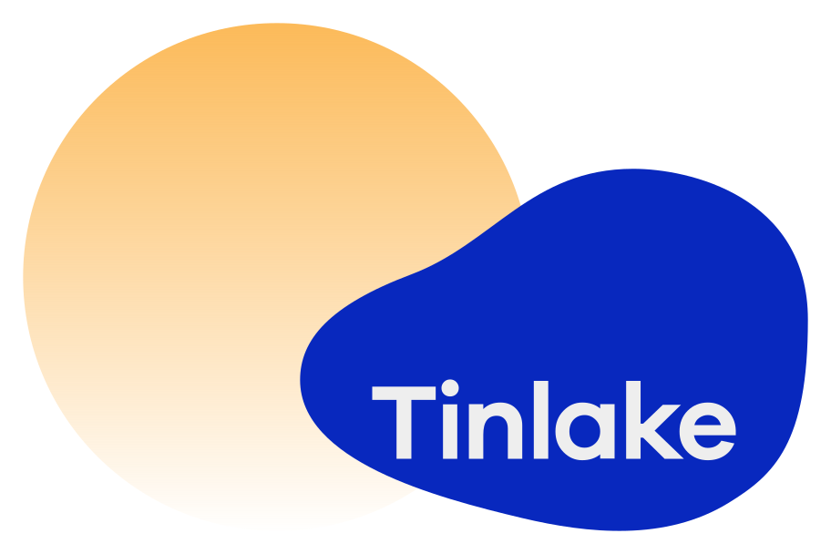
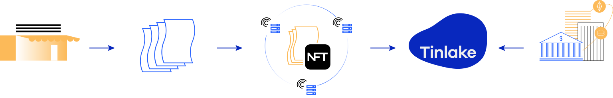
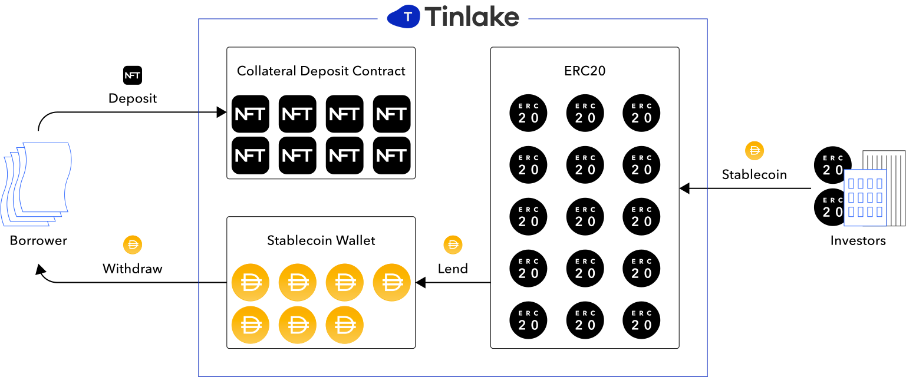
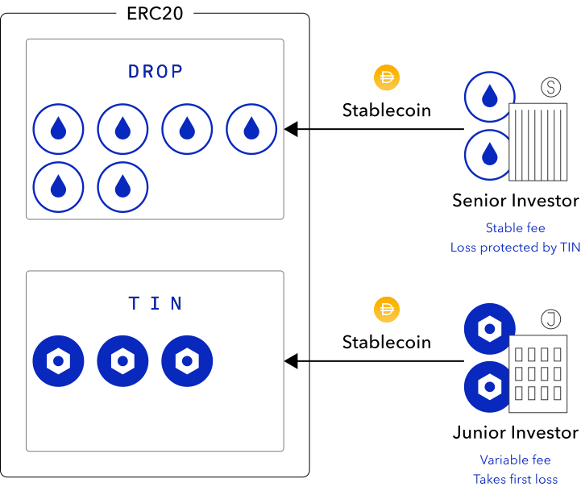

<!-- Introduction -->
<FullWidthSection>
<Row>
<Col span={7}>

</Col>
<Col span={1} />
<Col span={4}>

## Centrifuge Tinlake — Asset-backed lending protocol

Unlock the value of your real-world assets in the decentralized finance ecosystem.

<Button label="Explore Tinlake" href="https://tinlake.centrifuge.io" align="start" margin={{ top: "medium" }} target="_blank" rel="noreferrer noopener" />

</Col>
</Row>
</FullWidthSection>

<!-- What is Tinlake? -->
<Section>

# What is Tinlake?

Tinlake is a asset-backed lending smart contract platform that is designed for Asset Originators like lending platforms, payment companies, embedded software solutions, and banks that seek to utilize the full potential of decentralized finance. The protocol coordinates the various parties required to structure, administer, and finance collateralized pools of financial obligations like invoices, mortgages, auto loans, or royalties. By simplifying the process and reducing costs, Tinlake’s protocol creates financing flexibility for Asset Originators allowing them to optimize risk allocation and access instant funding from a new category of crypto lending protocols while simultaneously improving transparency and accessibility for their traditional investors.

</Section>
<FullWidthSection>
<ResponsiveContent breakpoints={["large", "medium"]}>

</ResponsiveContent>
<ResponsiveContent breakpoints={["small"]}>

<Image src="../../../images/tinlake/tinlake-flow-mobile.svg" width="50%" alignSelf="center" />

</ResponsiveContent>
</FullWidthSection>

<!-- Why we built Tinlake? -->
<Section>

# Why we built Tinlake?

Tinlake is built on top of the Centrifuge protocol. It allows for on-chain borrowing against collateralized loans completely managed by smart contracts. Not only does Tinlake enable Asset Originators to access the growing liquidity in the Decentralized Finance ecosystem, it also enables stablecoin issuers to offer a stable store of value backed by our collateralized loan pools. Ultimately, Tinlake will become a fully decentralized lending protocol that interoperates with different blockchains and plugs into a variety of funding sources, including a variety of stablecoins.

</Section>
<FullWidthSection>
<ResponsiveContent breakpoints={["large", "medium"]}>

</ResponsiveContent>
<ResponsiveContent breakpoints={["small"]}>

<Image src="../../../images/tinlake/tinlake-overview-mobile.svg" width="75%" alignSelf="center" />

</ResponsiveContent>
</FullWidthSection>

<!-- How does Tinlake work? -->
<Section>

# How does Tinlake work?

Tinlake’s set of smart contracts pool NFTs that represent non-fungible real world assets and use them as collateral to draw a loan in a stable crypto currency such as DAI or USDC. This is done by issuing fungible, interest bearing tokens that represent a claim on a fraction of the proceeds of the entire pool. These fungible tokens can be locked in crypto protocols or transferred to investors to draw funding. When liquidity is injected into Tinlake tokens are minted accordingly. The same mechanism applies in reverse when funding is paid out and tokens are burned.

Asset originators can create individual Tinlake pools per asset type, e.g. one dedicated pool for invoices and one pool for mortgages. All Tinlake pools are independent of each other and can be configured individually, e.g. with different interest rates. For funders, risk and proceeds are shared for each pool but not across pools.

<Row>
<Col span={6}>

Tinlake can be deployed with a two-token structure that allows investors to invest in two different kinds of fungible, interesting bearing tokens: TIN and DROP. Both tokens represent the liquidity deposited into Tinlake and accrue interest over time. TIN takes the risk of defaults first but also receives higher returns. DROP is protected against defaults by the TIN token and receives stable (but usually lower) returns. This is similar to common Junior/Senior investment structures.

</Col>
<Col span={1} />
<Col span={5}>
<ResponsiveContent breakpoints={["large", "medium"]}>

</ResponsiveContent>
<ResponsiveContent breakpoints={["small"]}>

<Image src="../../../images/tinlake/tinlake-work-mobile.svg" width="85%" alignSelf="center" />

</ResponsiveContent>
</Col>
</Row>
</Section>

<!-- Governance -->
<Section>

# Governance

The governance of Tinlake is important to manage the financing process. Tinlake provides flexible access for different Administrators to assume the responsibility of approving borrowers, underwriting and valuing assets, managing rates and funding sources, as well as keeping a balanced portfolio. In case of a payment default, collateral governance manages the liquidation of the assets. Tinlake facilitates the transparency of the collateral pool at any time. For provenance, risk assessment and collateral management Tinlake relies on price oracles. The Administrators could theoretically be single centralized entities, a set of smart contracts automatically qualifying and pricing an asset or a DAO that manages the Tinlake deployment.

</Section>

<!-- Benefits -->
<FullWidthSection>

# Benefits

<Row>
<Col span={4} margin={{ bottom: "medium" }}>

<Image src="../../../images/tinlake/benefits_originators.svg" width="100" margin={{ vertical: "small" }} />

### Originators

- Fast access to capital
- Cost effective process for collateralization
- Broader funder base
- Possibly lower cost sources of capital
- Ability to unlock new assets for funding

</Col>
<Col span={4} margin={{ bottom: "medium" }}>

<Image src="../../../images/tinlake/benefits_lenders.svg" width="100" margin={{ vertical: "small" }} />

### DeFi Lending

- Significant asset scalability
- Diversification with real-world assets
- Trust minimized smart contract counterparty solution
- Numerous on-chain credit enhancements to protect against defaults

</Col>
<Col span={4} margin={{ bottom: "medium" }}>

<Image src="../../../images/tinlake/benefits_investors.svg" width="100" margin={{ vertical: "small" }} />

### Traditional Investors

- Improved loan level transparency
- Potential yield enhancement from cost savings
- Composability for new forms of financing
- Access to newly unlocked asset classes

</Col>
</Row>
</FullWidthSection>

<Section>

# Interested in using Tinlake? Get in touch!

We work with a broad range of asset originators that are looking to offer additional financing services to their existing customer base or are interested in tapping into alternative financing sources. The platforms operate in different markets such as invoice financing, real estate and logistics. Complementarily, we collaborate with capital providers - both fiat and crypto - that want exposure to these types of assets.

Contact us if you are an Asset Originator, funder or service provider and you want to access the decentralized finance ecosystem.

In order to learn more about Tinlake please take a look at the Developer Documentation and corresponding blog posts on our Medium site.

</Section>

<Section>
<Text size="20px" alignSelf="center">Any Questions Left?</Text>
<Text size="20px" alignSelf="center">Please get in touch: <a href="mailto:tinlake@centrifuge.io">tinlake@centrifuge.io</a></Text>
</Section>
